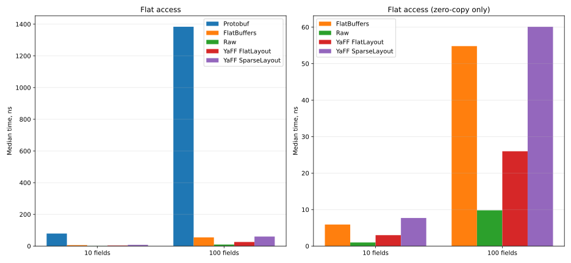
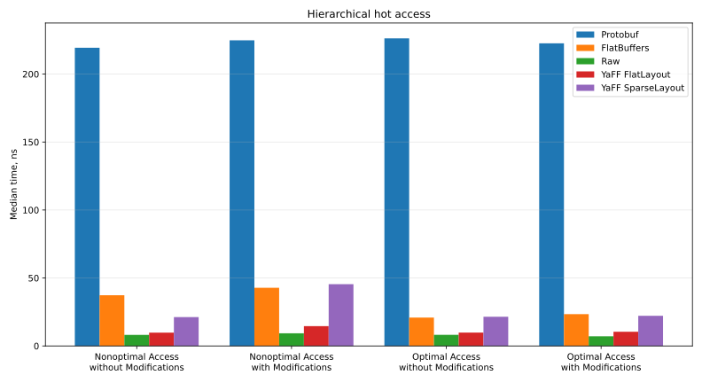
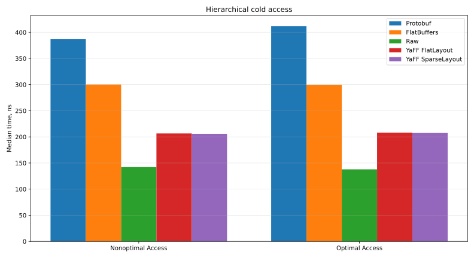

# Read Access

These benchmarks measure read access: the cost of reading every field out of an already-serialized buffer. Read access is where the layout choice shows up most directly, since each layout reaches a field through a different number of memory reads and branches (see [Layouts](../schema/layouts.md)).

Across every case, YaFF's Flat Layout is the fastest serialized format and stays close to the raw C++ struct baseline, while its Sparse Layout is competitive with FlatBuffers, often ahead.

See [Benchmarks](overview.md) for methodology and environment. The code lives in [benchmarks/access](https://github.com/yandex/yaff/tree/main/benchmarks/access).

> Flat Layout and Sparse Layout here are alternatives within the Dynamic layout.

| Case | Protobuf | FlatBuffers | Raw | YaFF Flat Layout | YaFF Sparse Layout |
| :--- | ---: | ---: | ---: | ---: | ---: |
| Flat / 10 fields | 79.13 | 5.90 | 1.00 | 2.99 | 7.69 |
| Flat / 100 fields | 1383.74 | 54.81 | 9.80 | 25.99 | 60.11 |
| Hierarchical / Hot / CacheChains:false / Modification:false | 219.35 | 37.30 | 8.14 | 9.79 | 21.23 |
| Hierarchical / Hot / CacheChains:true / Modification:false | 226.27 | 20.89 | 8.18 | 9.81 | 21.48 |
| Hierarchical / Hot / CacheChains:false / Modification:true | 224.84 | 42.80 | 9.31 | 14.58 | 45.44 |
| Hierarchical / Hot / CacheChains:true / Modification:true | 222.63 | 23.39 | 7.08 | 10.45 | 22.18 |
| Hierarchical / Cold / CacheChains:false | 387.48 | 300.13 | 142.13 | 206.64 | 205.95 |
| Hierarchical / Cold / CacheChains:true | 411.70 | 299.77 | 137.91 | 208.07 | 207.43 |

All values are the median time per read in nanoseconds.

## Flat Messages

The benchmark reads every field in sequence, so the total time is the per-field read cost multiplied across the message, which is where flat formats differ most. It uses two messages of uint64 fields, one with **10 fields** and one with **100**. Both sizes are common in practice, for example in messages exchanged between runtime services.



Protobuf is far slower than the rest, because a field cannot be read until the whole message has been parsed into an in-memory structure. The zero-copy formats, YaFF and FlatBuffers, skip that step and read each field straight from the buffer.

Among the zero-copy formats, YaFF's Flat Layout is the fastest: ahead of FlatBuffers by about **x2-2.5** and ahead of Protobuf by **x25-50**. It trails the raw C++ struct by **x2.5**, the cost of one extra read and a branch per field, since the Flat Layout consults a small header where a raw struct reads the field directly. Its Sparse Layout lands near FlatBuffers, with two advantages: the buffer is more compact, and it can switch to the faster Flat Layout when needed.

## Hierarchical Messages

Much data is hierarchical, and reading a deeply nested field means walking a chain of accessors down to it: `root.intermediate().leaf().a()`. The benchmark uses a three-level hierarchy, `Root`, `Intermediate`, `Leaf`, where the effect of nesting on performance is already visible.

### Raw C++ Baseline

The raw C++ struct serves as the baseline. A hierarchy can be modeled two ways physically: by inlining the nested objects into the parent, or by holding them through a pointer. The benchmark measures both, but the results report only the pointer form, since it more faithfully reflects the optional-field semantics of Protobuf and FlatBuffers.

### Access Chains

Reading a nested field means walking a chain of accessors down to it, for example `root.intermediate().leaf().a()`. When several fields of the same nested object are read, repeating the full chain redoes the same navigation every time:

```cpp
sum += root.intermediate().leaf().a();
sum += root.intermediate().leaf().b();
sum += root.intermediate().leaf().c();
```

Caching the intermediate step avoids that:

```cpp
auto leaf = root.intermediate().leaf();
sum += leaf.a();
sum += leaf.b();
sum += leaf.c();
```

At first glance this might look like a mere style choice: we expect the compiler to cache such accesses for us, as it does for Protobuf and raw structs. But FlatBuffers and YaFF read fields by reinterpreting raw memory as the target type, and this type-punning leaves TBAA without strong enough facts, so LLVM's alias analysis falls back to a conservative `MayAlias`. Combined with the per-level branches, this ties the optimizer's hands: CSE/GVN may not reuse the computed addresses of nested objects across accesses, since there is no proof the memory is unchanged across the branches.

YaFF partially works around this with annotations in its generated code that tell the compiler when the reuse is safe.

### Access Patterns

Reading a hierarchy falls into two patterns:

- **Random access** — a few fields are read from each of many messages. Here performance depends on how many distinct cache lines are read and how predictable those reads are.
- **Local access** — many fields are read from a single message. Here the format's per-access overhead and the efficiency of the generated code dominate.

Both occur in real systems, and the benchmark covers each. It emulates them through the working-set size: a cold run (random access, ~512 MB) for the first and a hot run (local access, ~2 KB) for the second.

#### Local Access (Hot)

This is the most frequent case in practice: high-load systems are written to be cache-aware, which makes it YaFF's primary target.

Reading YaFF's Flat Layout is **x3.5** faster than FlatBuffers and **x25** faster than Protobuf, and comes within **x1.2** of the raw C++ struct, since in a pointer-linked hierarchy even the raw baseline pays for the pointer hops.



Protobuf is again much slower, because the whole hierarchy must be parsed before any field can be read. Caching the access chain barely helps it, since the cost is in parsing, not in navigating the structure.

YaFF's Sparse Layout stores data much like FlatBuffers, so the two perform comparably. In the worst case for it, uncached access with intervening writes, the dynamic Sparse Layout falls slightly behind FlatBuffers, since it has to check the message layout at runtime on every access.

For FlatBuffers, caching the access chain by hand gives close to a **x2** speedup. YaFF reaches that level without it, in both layouts: its access pattern is simpler for the compiler to analyze, and the annotations in its generated code tell the compiler when reuse is safe, so as long as nothing writes to memory between reads, it caches the chain on its own.

#### Random Access (Cold)

The dominant cost is the first read of each message, which always lands in cold memory and forces a miss out to RAM. The raw C++ baseline carries no metadata, so it pays little beyond that first miss. The rest of the difference comes down to how many further cache lines a format must touch to reach a field, and how predictable those accesses are: a compact layout may keep the field in a line already fetched, while one that consults a separate meta table pays for another unpredictable miss.

The Flat and Sparse Layouts come out almost identical, and manual caching no longer helps, since the time goes into those misses, not into navigating the chain.

> Note on message size. YaFF can be more compact than FlatBuffers, so the same set of messages takes less memory and caches better. In this test a FlatBuffers message is 304 bytes, against 227 and 239 bytes for the Flat and Sparse layouts; Protobuf's maximum is comparable to YaFF at 256 bytes. To keep this compactness from skewing the cold results, the benchmark fixes the total size of all messages rather than their count.



Protobuf is still the slowest, but the gap is no longer large. The benchmark uses small messages with no strings, so parsing involves no heavy work, no allocation, copying, or variable-length decoding. Its cost is therefore comparable to that of the first cache miss, which is why Protobuf ends up only about x2 behind YaFF rather than the order of magnitude seen under hot access.

FlatBuffers trails YaFF by about **x1.5**. Its vtable sits apart from the data, so reaching a field costs an extra unpredictable miss that the other layouts avoid.

Across the cold cases the layout choice matters far less than the cost of reaching memory; YaFF stays the closest of the serialized formats to the raw baseline, about **x1.5** behind it.
