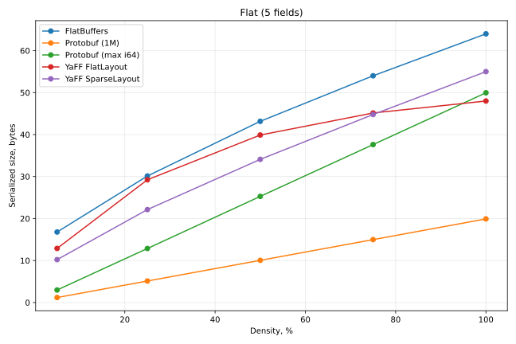
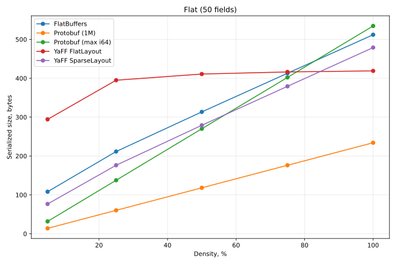

# Serialized Size

This section compares YaFF's layouts against each other and against FlatBuffers by serialized size. Together with the read-access results, this lets you pick the balance of speed and memory that best fits a given use case.

The results are summarized below. The `Density` column is the share of fields that are set; `MaxValue` is the magnitude of the values written, which affects only Protobuf.

See [Benchmarks](overview.md) for methodology and environment. The code lives in [benchmarks/space](https://github.com/yandex/yaff/tree/main/benchmarks/space).

> Flat Layout and Sparse Layout here are alternatives within the Dynamic Layout. The value magnitude affects only Protobuf, since its varint encoding is value-dependent; the fixed-width layouts store the same bytes regardless.

| Case | Protobuf (max i64) | Protobuf (1M) | FlatBuffers | YaFF Flat | YaFF Sparse |
| :--- | ---: | ---: | ---: | ---: | ---: |
| 5 fields / 100% | 49.96 | 19.92 | 64.00 | 48.00 | 55.00 |
| 5 fields / 75% | 37.58 | 14.98 | 53.91 | 45.14 | 44.77 |
| 5 fields / 50% | 25.23 | 10.05 | 43.08 | 39.90 | 34.11 |
| 5 fields / 25% | 12.90 | 5.12 | 30.11 | 29.24 | 22.15 |
| 5 fields / 5% | 2.97 | 1.18 | 16.81 | 12.89 | 10.25 |
| 50 fields / 100% | 534.61 | 234.17 | 512.00 | 419.00 | 479.00 |
| 50 fields / 75% | 402.42 | 176.27 | 412.91 | 416.32 | 379.31 |
| 50 fields / 50% | 269.87 | 118.29 | 313.55 | 410.96 | 279.04 |
| 50 fields / 25% | 137.44 | 60.27 | 211.49 | 395.16 | 176.28 |
| 50 fields / 5% | 31.76 | 13.95 | 108.37 | 294.43 | 76.60 |

Sizes are mean serialized bytes per message.

## Flat Messages

The serialized size of a flat message is shaped by two things: the cost of its metadata, and how unset fields are encoded. Unlike Protobuf, structures of FlatBuffers and YaFF do not use varint encoding to shrink scalar values, which makes the metadata and the representation of gaps the dominant factors.

The benchmark uses two uint64 structures. The 5-field structure shows how metadata weighs on the total size, while the 50-field structure depends more on how unset fields are represented. Each is measured across a range of densities. For Protobuf, the maximum value is varied as well, since its varint width depends on the magnitude of the data.

At full density Flat Layout carries the least metadata, which makes it the most compact zero-copy format here (fixed-width, without varint encoding). It comes out about **25%** smaller than FlatBuffers. The Sparse Layout falls between the two: its per-field metadata table is more compact than a FlatBuffers vtable, but it still carries more than the fixed header of Flat Layout, leaving it **14%** under FlatBuffers and above Flat Layout at full density.

As fields go unset, the picture shifts. The Flat Layout saves little, since it still stores every field up to the last one set, so below full density the Sparse Layout overtakes it. Sparse stays under FlatBuffers at every density, and its lead widens as the data thins out, reaching about **39%** at 5% density.

> This test compares only metadata and gap overhead. It leaves out alignment: with uint64-only fields nothing is padded, so it does not show that YaFF packs fields without the padding FlatBuffers inserts for mixed widths.

Protobuf with small values leads everywhere, since varints encode each field in fewer bytes. With large values its per-field cost is close to the Sparse Layout, but Protobuf still comes out smaller, because it stores nothing at all for an unset field.

For the 50-field structure the dominant factor changes: metadata is no longer the largest contributor, and the overhead of representing unset fields determines the total.

In the Flat Layout, setting field _N_ requires writing every field before it, from _0_ to _N_. The size therefore saturates quickly: once the last field is set, the message is already at its full-density size, regardless of how many fields in between are unset. On the plot, the Flat Layout curve rises steeply and then flattens into a plateau.

The Sparse Layout and FlatBuffers work the other way: setting field _N_ writes metadata for fields _0_ to _N_, but no value for the unset ones. Size then grows linearly with the number of fields actually set, as the plot shows.

At low density the Flat Layout pays a high overhead, but at full density it is the most compact format of all, **18%** smaller than FlatBuffers. The Sparse Layout stays close to Protobuf (varints aside) and is the most compact format once more than half the fields are set. In part of that range it even beats Protobuf, because its one-byte metadata slots reach further: a one-byte field meta covers ids up to 31 in the Sparse Layout, but only up to 15 in Protobuf.

Taken together, these results highlight YaFF's core advantage: rather than committing to one size-versus-speed tradeoff, you choose the layout that fits your data. And because the layout is dynamic, that choice need not be fixed in the schema; the runtime can make it during serialization, from the data it is writing.
